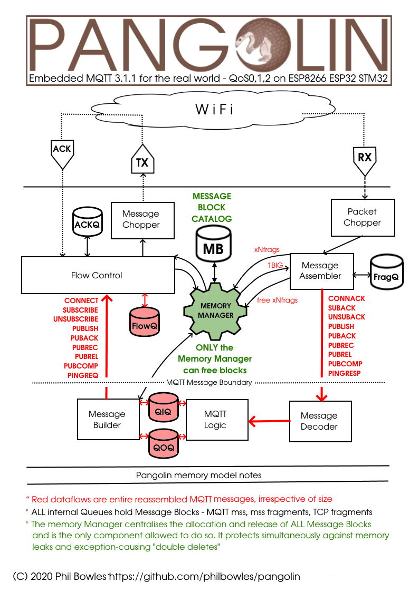

# Coming Soon:
## PangolinMQTT - ArduinoIDE client library for ESP8266, ESP32 and STM32-NUCLEO

###### *Version 0.0.6 - Alpha testers only - please do not fork/download unless you have been specifically asked*



# Contents
* [Features](#features)
* [Comparison with AsyncMqttClient](#comparison-with-asyncmqttclient) (and "Quick Start" guide)
* [Example Sketches](#examples)
  
---

# Features
 * Full* MQTT v3.1.1 Qos0/1/2 compliance, session management and recovery
 * Payload size limited only by available heap (~20kB on ESP8266)
 * Compilable diagnostics and testing topics:
   * dump
   * reboot
   * disconnect
   * break selected QoS1/2 handshakes for session recovery testing
   * fix broken handshakes for session recovery testing
 * Utility functions to view binary payloads and handle as:
   * C-style string (`char*`)
   * `std::string`
   * Arduino `String`
   * `int` from any the above string types
 * Error-handling for:
   * QoS failures*
   * Subscribe failure
   * "Killer" packets ( > free available heap) both inbound and outbound

**NB** *No device can *fully* comply with MQTT 3.1.1 QoS unless it has unlimited permanent storage to hold failed QoS messages across reboots. A future version will use LittleFS to perform this function. For more in depth explanation of the reasons, read [Challenges of MQTT QoS on embedded systems](docs/qos.md) which compares how the inevitable shortfall is handled by three different libraries:

* `PubSubClient`  - not at all: QoS0 only and 128-byte payload limit
* `AsyncMqttClient` - poorly / not at all: crashes on huge inward packets, limits outbound to 1-2kB and loses QoS1/2 recovery messages, fails to attempt session recovery and has no method of informing the user of either failure. Put simply, *it doesn't work*
* `Pangolin` (*this* library) - as far as is technically possible, while informing the user of inevitable inherent failures.

## All of this:

### Quick Start for existing users of `AsyncMqttClient`

Pangolin *tries* to preserve API compatibility with `AsyncMqttClient` but that library contains illogical and incorrect features, which means that you will have to make minor changes to two or three lines of code in your existing apps before using them with Pangolin.

Those have been "fixed" in this release of Pangolin *only* to make it quick and easy for users to move their apps to Pangolin with minimum effort and without compile errors, but they *will* change to "sensible" equivalents in the next release.

For an in-depth analysis (with evidence) of those problems, read [API issues](api.md)

Take a look at the first - very simple - example which exists in two forms: A ["P_" version](examples/QuickStart_P/QuickStart_P.ino) which uses Pangolin and an ["A_" version](examples/QuickStart_A/QuickStart_A.ino) which uses `AsyncMqttClient`. A side-by-side comparison of the two shows the very minimal changes required to get you up and running. (Also a single glance at the [comparison](#comparison-with-asyncmqttclient) of the two outputs gives a good overview of the major differences between Pangolin and `AsyncMqttClient`)

The remainder of the Examples start with the "U_" prefix which signifies "Unified". See the [section below](#examples) on what this means an how to get the best out of them.

### A better API

In the table below, **CHG** = those few API calls that have *had* to be changed just to "make sense" for the first release. These serve as a handy guide to the minimum you need to change in your current code.

**DEP** calls are "deprecated" which means they will change at the next release (this automatically includes those in the CHG category)

**REM** shows calls which will be completely removed at the next release for one of these reasons:

1. They have no practical function
2. They have confusing and/or misleading parameters
3. Both of the above

**NEW** shows functions only available in Pangolin which provide functionality required for correct operation but which `AsyncMqttClient` does not provide.

Missing from the table below are the following, which live in the `PANGO::` namespace and are designed to make a very simple task of *correct* payload handling.

```cpp
void                dumphex(uint8_t* mem, size_t len,uint8_t W);
char*               payloadToCstring(uint8_t* data,size_t len);
int                 payloadToInt(uint8_t* data,size_t len);
std::string         payloadToStdstring(uint8_t* data,size_t len);
String              payloadToString(uint8_t* data,size_t len);
```

**TODO** Update diagram


## And NONE of this (so far: it's "alpha"!)


---

# Comparison with AsyncMqttClient

This is the screenshot of the outputs of the two versions of the first example sketch, the first running [`AsyncMqttClient`](examples/QuickStart_A/QuickStart_A.ino) and the  second running [Pangolin](examples/QuickStart_P/QuickStart_P.ino)


As you can see there are (at least) four major benefits of using Pangolin over `AsyncMqttClient` right from the start:

## 1 Large Payloads

### Executive summary

Pangolin handles any sized payload up to 1/2 the available heap both inbound and outbound. `AsyncMqttClient` cannot properly handle even medium-sized packets outbound and simply makes no attempt to handle large inbound packets, expecting the user to do it.

### TL;DR The `AsyncMqttClient` way

`AsyncMqttClient` can only *correctly* handle a maximum *outbound* payload size* of the TCP MSS size*. "What's that?" I hear you ask. Exactly. It's an implementation-dependent value that `AsyncMqttClient` provides no way for you to discover. It changes according to the ArduinoIDE build settings.


If you choose the "Lower Memory" option it is 536, "Higher Bandwith" gives you 1460. Despite the fact that ArduinoIDE allocates 2x this size (e.g. 1072 vs 2920) it seems that `AsyncMqttClient` has ["issues"](#5-not-shown-far-less-bugs) dealing with anything over the single buffer size.

It is important to note that any future ArduinoIDE (*"ESP8266 core"* to be more precise) changes are made these values,`AsyncMqttClient` is likely to break in new and different ways from those it already does.

*Inbound* payloads > TCP MSS size* have a *different* problem: `AsyncMqttClient` expects *you* the user to reassemble the fragments. That is what the `index` and `total` fields are for in the `onMessage` function. Doing this is a non-trivial task and probably beyond many new users. It is also highly error-prone: if you blindly assemble any packet `AsyncMqttClient` lets through and one of them is bigger than about 1/2 your free heap, your MCU *will* crash.

Even if your non-trivial packet reassembler spots the incoming packet is too big, it *still* has to safely ignore all of the fragments up to the next "sensibly-sized" packet. `AsyncMqttClient` just keeps on sending them - and cannot be stopped - whether you can handle them or not.

*( * The TCP packet must also contain the topic name and some fixed MQTT information, thus the actual maximum **payload** data itself will necessarily be reduced by this amount )*

### TL;DR The Pangolin way

Pangolin automatically fragments outbound packets and reassembles inboundof any size up to about 1/2 the free heap. User code simply gets a copy of the full packet - irrespective of its size - without any fuss and requiring *zero* code on his/her part.

It also provides a new function `getMaxPayloadSize` and a new `onError` callback that allows the users to safely and informatively handle any "killer packet" scenario without crashing.

## 2 *Significant* performance improvements

### Executive Summary

Pangolin is simply faster, full stop. The exact amount depends to a great extent on the size / frequency / combination of inbound/outbound messages, but in certain instances can show *huge* improvements. See the [Time-of-Flight](x) example sketch for more detail and a full analysis.

## 3 Additional functionality

### Executive Summary

`AsyncMqttClient` seems to assume all payloads are strings. Not only is *not* the case, but it provides no functions to assist the user in examining, parsing, converting  or "unpacking" the payload.

Pangolin provides:

```cpp
void                dumphex(uint8_t* mem, size_t len,uint8_t W);
char*               payloadToCstring(uint8_t* data,size_t len);
int                 payloadToInt(uint8_t* data,size_t len);
std::string         payloadToStdstring(uint8_t* data,size_t len);
String              payloadToString(uint8_t* data,size_t len);
```


## 4 Stability

## Executive Summary

Pangolin is "alpha" so *of course* it is likely to contain bugs. What *can* be said though is that whatever yet-to-be-found bugs it may still contain, even at this first release it does *not* contain the bug that causes `AsyncMqttClient` to regularly (but at random) enter a disconnect/reconnect cycle - which is *so* common it will be referred to from now as "DCX/CNX".

Neither does it contain any of the other bugs in `AsyncMqttClient` described in the next section. Once past the early "smoke test" stages of devlopment it has never spontaneously done a DCX/CNX loop. Given that the whole reason for its existence was to cure that annoying bug in `AsyncMqttClient`, the reader should take comfort from it. Only time will tell.

## 5 (not shown) Far less bugs

As well as the main cause of *many* problems with `AsyncMqttClient` (Spontaneously and randomly entering DCX/CNX loop) Pangolin avoids many others.

The [U_ShowTheBugs] example did not get its name by accident or whim. It offers the user a menu of options which he/she can change at runtime to demonstrate numerous "normal" scenarios where the Pangolin version performs exactly as expected but the `AsyncMqttClient` version takes it pick from any of the following

* Simply not doing what is has been told, but telling the user it has done it
* Doing what it is told, but doing it wrongly e.g. corrupting data (usually with no indication that anything has gone wrong)
* Entering an infinite DCX/CNX loop
* Crashing instantly
* Crashing at some short random later time
* Egregious breaches of MQTT QoS promises (failing to ACK, failing to re-deliver etc)

---

# Examples

The "unified" examples starting with the "U_" prefix contain code which will compile with either lib simply by adding or removing `#define USE_PANGOLIN` in your sketch. 

To be able to do this, they hide all of the "machinery" (e.g. to connect / reconnect to WiFi etc) in the `options.h` file which must accompany each sketch. Other than knowing that you need it, you do not ever need to look inside it or change anything in it. If you do it will probably break other things.

Also defined in `options.h` (and the example itself) are a set of functions called `unifiedXXXX` where the XXXX is `subscribe`, `publish` etc as for the "normal" API functions. These "iron out" any API differences in the libs and allow the real "meat" or purpose of the sketch to contained wholly within a very small .ino file.

It also means that the code in that .ino file is *identical* for both libs, to make any comparisos both valid and easy to compare.

Note that this is purely so that the one body of code will run on both libs, for the purposes of these demos: you would *not* normally write your code this way. For the common, simple way to do that, see the [QuickStart](examples/QuickStart_P/QuickStart_P.ino) example.

**CAVEAT:** `AsyncMqttClient` is *so* unstable that some of the *predicted* crash behaviour my differ on your setup / device. This is one of the most pernicious problems with it: its behaviour is highly random.

In truth it works (ish) *only* on the "Happy Path": very small text-only payloads, low bandwith loading, zero QoS fails / retransmits, clean strong net with few TCP disconnects - in short: "classroom" conditions and not at all like the real world. Even then it *still* randomly DCX/CNX 5,6 10 ? times  a day. Basically, ***it just doesn't work***

During the developement of the examples below, apparently random crashes and "bad behaviour" other than the designed/intended failure mode were not at all uncommon, so - as they say - "Your mileage may vary".

## Sketches

All sketches should be compiled with the LwIP "Lower Memory" option unless specified otherwise, ot they may not fail as intended

More detail about each sketch, how to run it , how to analyse and interpret the results etc is found in [Examples in detail](examples.md)

* [QuickStart](examples/QuickStart_P/QuickStart_P.ino) Simple + easy starting point
* [A_ShowStopper]() Bug that causes sketch not to run *at all* so we get it out the way first, before...
* [P_NoStopper]() Same code as above, but no DCX/CNX loop
* [U_ShowTheBugs]() User-controllable demos of several more serious bugs in `AsyncMqttClient`
* [U_TimeOfFlight]() Performance comparison at QoS0/1/2 (surprising results!)
* [U_BrokenPromises]() Experts only: complex session recovery and QoS fails in `AsyncMqttClient`

Obviously, it goes without saying that all of the above run correctly when compiled with `#define USE_PANGOLIN`