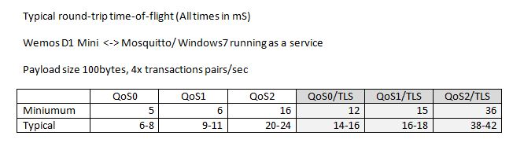
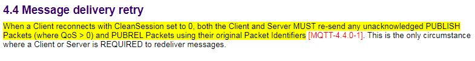
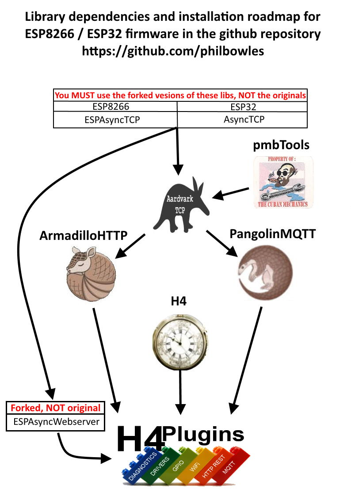
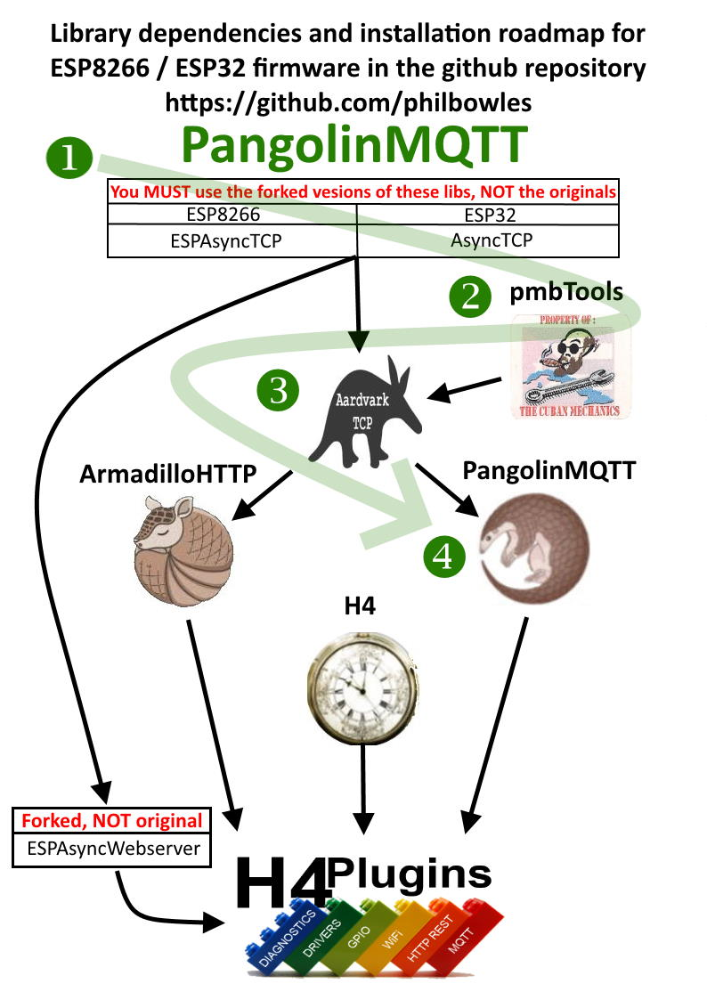

# Asynchronous ArduinoIDE MQTT 3.1.1 client library for ESP8266, ESP32

---

## If you are able, please [Support me on Patreon](https://patreon.com/esparto) and/or subscribe to my [Youtube channel (instructional videos)](https://www.youtube.com/channel/UCYi-Ko76_3p9hBUtleZRY6g)

---

###### Version 3.0.2 [Release Notes](docs/rn300.md)

* [Features](#features)
* [Performance](#performance)
* [Unique features](#features-you-may-not-find-in-other-libraries)
* [PangolinMQTT's place in "The Menagerie"](#the-menagerie-roadmap)
* [Installation](#installation)
* [Issues](#issues)

# Other Documents
* [Getting Started](101.md)
* [Payload Handling and "expert" functions](pl.md)
* [Full API specification](docs/api.md)
* [Using TLS](docs/tls.md)
* [Challenges of embedded MQTT](docs/qos.md)
  
---

# Features

 * Full* MQTT v3.1.1 Qos0/1/2 compliance, session management and recovery
 * Payload size limited only by available heap (~20kB on ESP8266, ~120kb on ESP32)
 * TLS support (ESP8266 only)
 * Compile-time multilevel diagnostic
 * Utility functions to view binary payloads and handle as:
   * C-style string (`char*`)
   * `std::string`
   * Arduino `String`
   * < any arithmetic type >
 * Full error-handling including:
   * QoS failures*
   * Subscribe failure
   * "Killer" packets ( > free available heap) both inbound and outbound

**NB** *No device can *fully* comply with MQTT 3.1.1 QoS unless it has unlimited permanent storage to hold failed QoS messages across reboots. For more in-depth explanation of the reasons, read [Challenges of MQTT QoS on embedded systems](docs/qos.md) 

---

# Performance

---

# Features you may not find in other libraries:

## Large Payloads

PangolinMQTT automatically fragments outbound packets and reassembles inbound packets of any size up to about 1/2 the free heap. User code simply gets a copy of the full packet - irrespective of its size - without any fuss and requiring *zero* code on the user's part.

## Full QoS1 / QoS2 compatibility / recovery

PangolinMQTT's author is unaware of any similar libraries for ESP8266/ESP32 that *fully* and *correctly* implement QoS1/2 *in all circumstances*.

They *may* sometimes work, e.g. with only small packets and/or slow send rates but fail when either increases. None will correctly recover "lost" messages on unexpected disconnect. Given that this is pretty much the *only* purpose of QoS1/2 then any library *not* fulfilling this promise *cannot* legitimately claim to be QoS1/2 compatible. If a library does not do this:

Then it ***does not support QoS1/2*** no matter what claims it may make.

---
---

# The "menagerie" roadmap

PangolinMQTT is one of a family of firmware packages for simple *robust* and rapid ***asynchronous*** IOT development on ESP8266 / ESP32

SEE [Installation](#installation)

## The related / dependent libraries

|| Name | Provides | Notes |
| :---: | :----------  | :--- | :--- |
||[Forked AsyncTCP](https://github.com/philbowles/AsyncTCP-master)|"Glue" to LwIP (ESP8266)| Important bugfixes |
||[Forked ESPAsyncTCP](https://github.com/philbowles/ESPAsyncTCP-master)|"Glue" to LwIP(ESP32)| Missing features added |
||[Forked ESPAsyncWebserver](https://github.com/philbowles/ESPAsyncWebServer)| Basis of webUI in H4Plugins| Several major bugfixes |
||[PMB Tools](https://github.com/philbowles/pmbtools)|'32/'8266 HAL and utility functions| |
||[AardvarkTCP](https://github.com/philbowles/AardvarkTCP)|Simple Large-payload Async TCP| API-compatible with ESPAsyncTCP, seamless TLS/SSL |
||[PangolinMQTT](https://github.com/philbowles/PangolinMQTT)|Async MQTT Client|QoS 0/1/2 Fully 3.1.1 compliant. Large payloads |
||[ArmadilloHTTP](https://github.com/philbowles/ArmadilloHTTP)|Async HTTP/S Client| Simple send/callback of large payloads |
||[H4](https://github.com/philbowles/H4)|Scheduler/Async Timers| |
||[H4/Plugins](https://github.com/philbowles/h4plugins)|Full Async IOT Firmware| Webserver, MQTT, OTA, NTP, HTTP etc etc |

## PangolinMQTT installation path

---
## Compiling

---

# Installation

Please see [H4 Installer](https://github.com/philbowles/h4installer)
# Issues

## If you want a *quick* resolution, please follow these rules:

1. As with all H4 and H4Plugins libraries, please make sure you have read *all* the relevant documentation relating to the issue and watched any videos on the [Youtube channel (instructional videos)](https://www.youtube.com/channel/UCYi-Ko76_3p9hBUtleZRY6g). Please also subscribe to the channel for notifications of news and updates.

2. If you still think there is a problem, then join the [Facebook H4  Support / Discussion](https://www.facebook.com/groups/444344099599131/) group and report the issue briefly there. This is because I visit the group every day, whereas I do not have time to visit 11 github repos every day. Furthermore, it alerts other users to potential problems and allows an initial assessment. 

3. If there is a genuine issue then you will be referred to [Raising H4/H4Plugins issues](https://github.com/philbowles/h4plugins/blob/master/docs/issues.md) after which you are advised to create a full github issue report.

4. Failing to make an initial report in the [Facebook H4  Support / Discussion](https://www.facebook.com/groups/444344099599131/) group and simply starting with a github issue, or failing to include all of the information required in [Raising H4/H4Plugins issues](https://github.com/philbowles/h4plugins/blob/master/docs/issues.md) is likely to result in a ***long*** delay before it gets picked up.

---

(c) 2021 Phil Bowles h4plugins@gmail.com

* [Support me on Patreon](https://patreon.com/esparto)
* [Youtube channel (instructional videos)](https://www.youtube.com/channel/UCYi-Ko76_3p9hBUtleZRY6g)
* [Facebook H4  Support / Discussion](https://www.facebook.com/groups/444344099599131/)
* [Facebook General ESP8266 / ESP32](https://www.facebook.com/groups/2125820374390340/)
* [Facebook ESP8266 Programming Questions](https://www.facebook.com/groups/esp8266questions/)
* [Facebook ESP Developers (moderator)](https://www.facebook.com/groups/ESP8266/)