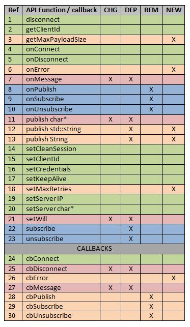
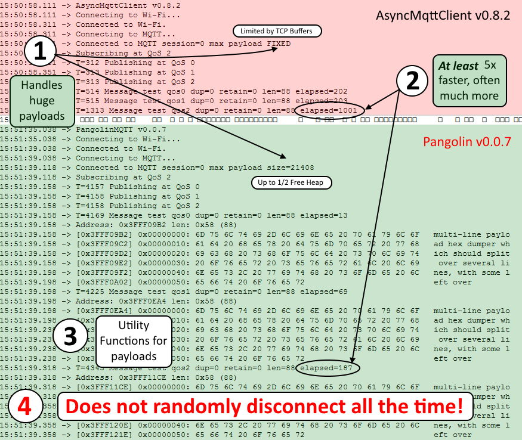

# ArduinoIDE MQTT client library for ESP8266, ESP32 and STM32-NUCLEO

###### *Version 0.0.8 [Release Notes](docs/rn008.md)- Beta - not recommended (yet) for critical applications*


* [Features](#features)
* [Performance](#performance)
* [Comparison with AsyncMqttClient](#comparison-with-asyncmqttclient)
* [Installation](#installation)
* [Issues / Support](#issues--support)
* [IMPORTANT NOTE FOR PLATFORMIO USERS](#important-note-for-platformio-users)

# Other Documents
* [Using TLS](docs/tls.md)
* [STM32 targets](docs/stm32.md)
* [Challenges of embedded MQTT](docs/qos.md)
* [Problems / errors in the AsyncMqttClient API](docs/api.md)
* [List of 16 fatal bugs in AsyncMqttClient (with evidence)](docs/bugs.md)
* [Example Sketches](docs/examples.md)
  
---

# Features

 * Full* MQTT v3.1.1 Qos0/1/2 compliance, session management and recovery
 * Payload size limited only by available heap (~20kB on ESP8266, ~120kb on ESP32)
 * TLS support (ESP8266 only)
 * Compilable diagnostics and testing topics:
   * dump
   * reboot
   * disconnect
   * break selected QoS1/2 handshakes for session recovery testing
 * Utility functions to view binary payloads and handle as:
   * C-style string (`char*`)
   * `std::string`
   * Arduino `String`
   * `int` from any the above string types
 * Error-handling for:
   * QoS failures*
   * Subscribe failure
   * "Killer" packets ( > free available heap) both inbound and outbound

**NB** *No device can *fully* comply with MQTT 3.1.1 QoS unless it has unlimited permanent storage to hold failed QoS messages across reboots. A future version will use LittleFS to perform this function. For more in depth explanation of the reasons, read [Challenges of MQTT QoS on embedded systems](docs/qos.md) which compares how the inevitable shortfall is handled by three different libraries:

* `PubSubClient`  - not at all: QoS0 only and 128-byte payload limit
* `AsyncMqttClient` - poorly / not at all: crashes on huge inward packets, limits outbound to 1-2kB and loses QoS1/2 recovery messages, fails to attempt session recovery and has no method of informing the user of either failure. Put simply, *it doesn't work*
* `Pangolin` (*this* library) - as far as is technically possible, while informing the user of inevitable inherent failures.

---

# Performance


---

## Quick Start for existing users of `AsyncMqttClient`

Pangolin *tries* to preserve API compatibility with `AsyncMqttClient` but that library contains illogical and incorrect features, which means that you will have to make minor changes to two or three lines of code in your existing apps before using them with Pangolin.

Those have been "fixed" in this release of Pangolin *only* to make it quick and easy for users to move their apps to Pangolin with minimum effort and without compile errors, but they *will* change to "sensible" equivalents in the next release.

For an in-depth analysis (with evidence) of those problems, read [API issues](api.md)

Take a look at the first - very simple - example which exists in two forms: A ["P_" version](examples/QuickStart_P/QuickStart_P.ino) which uses Pangolin and an ["A_" version](examples/QuickStart_A/QuickStart_A.ino) which uses `AsyncMqttClient`. A side-by-side comparison of the two shows the very minimal changes required to get you up and running. (Also a single glance at the [comparison](#comparison-with-asyncmqttclient) of the two outputs gives a good overview of the major differences between Pangolin and `AsyncMqttClient`)

The remainder of the Examples can be compiled for either Pangolin or AsyncMqttClient to allow you to compare the two libraries in the few cases where AsynClientMqtt doesn't fail. See the [Example Sketches](docs/examples.md) on how to run them and get the best out of the code.

---

## A better API

In the table below, **CHG** = those few API calls that have *had* to be changed just to "make sense" for the first release. These serve as a handy guide to the minimum you need to change in your current code.

**DEP** calls are "deprecated" which means they will change at the next release (this automatically includes those in the CHG category)

**REM** shows calls which will be completely removed at the next release for one of these reasons:

1. They have no practical function
2. They have confusing and/or misleading parameters
3. Both of the above

**NEW** shows functions only available in Pangolin which provide functionality required for correct operation but which `AsyncMqttClient` does not provide.

Missing from the table below are the following, which live in the `PANGO::` namespace and are designed to make a very simple task of *correct* payload handling.

```cpp
void                dumphex(uint8_t* mem, size_t len,uint8_t W);
char*               payloadToCstring(uint8_t* data,size_t len);
int                 payloadToInt(uint8_t* data,size_t len);
std::string         payloadToStdstring(uint8_t* data,size_t len);
String              payloadToString(uint8_t* data,size_t len);
```

**TODO** Update diagram



Full details, explanation and rationale for the changes [here](docs/api.md)

## And NONE of this (so far: it's "alpha"!)


---

# Comparison with AsyncMqttClient

This is the screenshot of the outputs of the two versions of the first example sketch, the first running [`AsyncMqttClient`](examples/QuickStart_A/QuickStart_A.ino) and the  second running [Pangolin](examples/QuickStart_P/QuickStart_P.ino)



As you can see there are (at least) four major benefits of using Pangolin over `AsyncMqttClient` right from the start:

## 1 Large Payloads

### Executive summary

Pangolin handles any sized payload up to 1/2 the available heap both inbound and outbound. `AsyncMqttClient` cannot properly handle even medium-sized packets outbound and simply makes no attempt to handle large inbound packets, expecting the user to do it. [Read more](docs/bugs.md)

### TL;DR The `AsyncMqttClient` way

`AsyncMqttClient` can only *correctly* handle a maximum *outbound* payload size* of the TCP MSS size*. "What's that?" I hear you ask. Exactly. It's an implementation-dependent value that `AsyncMqttClient` provides no way for you to discover. It changes according to the ArduinoIDE build settings.


If you choose the "Lower Memory" option it is 536, "Higher Bandwith" gives you 1460. Despite the fact that ArduinoIDE allocates 2x this size (e.g. 1072 vs 2920) it seems that `AsyncMqttClient` has ["issues"](docs/bugs.md) dealing with anything over the buffer size.

### TL;DR The Pangolin way

Pangolin automatically fragments outbound packets and reassembles inbound packets of any size up to about 1/2 the free heap. User code simply gets a copy of the full packet - irrespective of its size - without any fuss and requiring *zero* code on his/her part.

It also provides a new function `getMaxPayloadSize` and a new `onError` callback that allows the users to safely and informatively handle any "killer packet" scenario without crashing.

## 2 *Significant* performance improvements

### Executive Summary

Pangolin is simply faster, full stop. The exact amount depends to a great extent on the size / frequency / combination of inbound/outbound messages, but in certain instances can show *huge* improvements. See the [examples](docs/examples.md) for more detail.

## 3 Additional functionality

### Executive Summary

`AsyncMqttClient` seems to assume all payloads are strings. Not only is *not* the case, but it provides no functions to assist the user in examining, parsing, converting  or "unpacking" the payload.

Pangolin provides:

```cpp
void                dumphex(uint8_t* mem, size_t len,uint8_t W);
char*               payloadToCstring(uint8_t* data,size_t len);
int                 payloadToInt(uint8_t* data,size_t len);
std::string         payloadToStdstring(uint8_t* data,size_t len);
String              payloadToString(uint8_t* data,size_t len);
```

---

## 4 Stability

Pangolin is "alpha" so *of course* it is likely to contain bugs. What *can* be said though is that whatever yet-to-be-found bugs it may still contain, even at this first release it does *not* contain the bug that causes `AsyncMqttClient` to regularly (but at random) enter a disconnect/reconnect cycle - which is *so* common it will be referred to from now as "DCX/CNX". Neither does it contain the bug which prevents AsyncMqttClient from totally failing to implement QoS1 and 2, nor any of the other 16 fatal bugs in AsyncMqttClient [listed here](docs/bugs.md)

At the time of writing, a "soak test" of the [Session Recovery 2 example sketch](examples/SessionRecovery2/SessionRecovery2.ino) shows that PangolinMQTT has been running for 194022 seconds (53.895 hours) without a single reconnection or message lost, while sending and receiving a QoS2 message every second.


---

# Installation

Pangolin depends upon the excellent libraries [ESPAsyncTCP](https://github.com/me-no-dev/ESPAsyncTCP) (for ESP8266 targets) or [AsyncTCP](https://github.com/me-no-dev/AsyncTCP) for ESP32 targets.

You will need to install one or both of those before using Pangolin

See also [Using TLS](docs/tls.md) for additional dependencies

See also [STM32 targets](docs/stm32.md) for additional dependencies and information on using Pangolin on STM32-NUCLEO boards

---

# Issues / Support

## IMPORTANT NOTE FOR PLATFORMIO USERS

Pangolin is an *Arduino library*, and is 100% compatible with the ArduinoIDE and build system. PlatformIO, sadly, ***is not***. If PlatformIO has problems with code that compiles and runs correctly under ArduinoIDE, then it is a ***PlatformIO problem***, not an issue with this - or any other - valid Arduino library.

For over 3 years I have been notifying the PlatformIO team of errors in their build setting related to the use of non-standard and non ArduinoIDE-compatible architecture #defines which break *many* vaild Arduino libraries. For over 3 years they have failed to fix it,so I refuse to provide any support on any of my 100% Arduino compatible libraries for users of PlatformIO until they do.

For this reason, I will not accept any issues relating to build problems with PlatformIO, nor any pull requests or other suggestions which involve any changes that render the library less than 100% ArduinoIDE compatible. If you don't like this, you have two options:

* Petition, moan, complain to PlatformIO dev team to make it 100% Arduino-compatible
* Use another library: my position ***will not change*** until PlatformIO ~~get off their lazy asses~~ fix their problems

## Non PlatformIO-related issues

Obviously I will check the issues here from time to time, but if you want a rapid resonse, I can usually be found moderating on of these FB groups, including a new one especially set up for Pangolin users:

* [Pangolin Support](https://www.facebook.com/groups/pangolinmqtt/)
* [ESP8266 & ESP32 Microcontrollers](https://www.facebook.com/groups/2125820374390340/)
* [ESP Developers](https://www.facebook.com/groups/ESP8266/)
* [H4/Plugins support](https://www.facebook.com/groups/h4plugins)

(C) 2020 Phil Bowles
