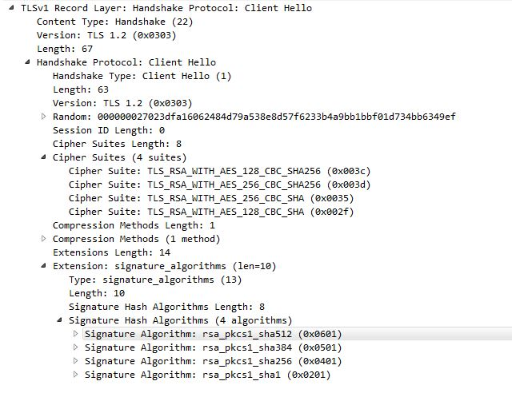

# Main API Contents

* [Callbacks](#callbacks)
* [API](#api)
    * [URL Definition](#url-defintion)
    * [Using TLS](#using-tls)
    * ["Pre-flighting" and phases](#pre-flighting-and-phases)
    * [Response Handling](#respsonse-handling)
    * [Functions](#functions)
* [Advanced Topics](#advanced-topics)

---
# Callbacks

```cpp
// M A N D A T O R Y ! ! !
void cbConnect(bool session); // session = whether connection has started with a dirty session
// M A N D A T O R Y  if subscribing:
void cbMessage(const char* topic, const uint8_t* payload, size_t len,uint8_t qos,bool retain,bool dup);
// O P T I O N A L
void cbDisconnect(int8_t reason);
/*
LwIP produces [error codes](https://www.nongnu.org/lwip/2_0_x/group__infrastructure__errors.html) with negative value and these get fed back up through ESPAsyncTCPeventually to this library, which also has a few of its own valid reasons. How to tell the difference? All of Pangolin's are +ve, but if you get a rare underlying TCP error which will help in diagnosing problems, you will also get told that (-ve) reason code
*/
void cbError(uint8_t error,int info); // info is additional information about the error whose code is one of:
/*
TCP_DISCONNECTED, // usually because your program structure is wrong, e.g. you called publish when you arent connected
MQTT_SERVER_UNAVAILABLE, // usually when server crashes or times out
UNRECOVERABLE_CONNECT_FAIL, // usually your credentials are incorrect
TLS_BAD_FINGERPRINT, // SHA1 does not match server certificate's fingerprint
TLS_NO_FINGERPRINT, // HTTPS selected and no SHA1 fingerprint given
TLS_NO_SSL, // TLS is not compiled in see docs "using TLS"
TLS_UNWANTED_FINGERPRINT, // fp supplied when http insecure url given
SUBSCRIBE_FAIL, // invalid topic provided
INBOUND_QOS_ACK_FAIL, // an ID has been provided by the server that is no longer held by us (usually after crash/reboot with open session)
OUTBOUND_QOS_ACK_FAIL,// an ID has been provided by the server that is no longer held by us (usually after crash/reboot with open session)
INBOUND_PUB_TOO_BIG, // someone sent you a waaaaaay too big message
OUTBOUND_PUB_TOO_BIG, // you tried to send out a a waaaaaay too big message
BOGUS_PACKET, // should never happen - server sent malformed / unrecognised packet - SERIOUS PROBLEM
X_INVALID_LENGTH // length of payload does not match expected data type in x functions - server sent malformed message - SERIOUS PROBLEM
NO_SERVER_DETAILS // very silly if you let this happen - call setServer before connect!!!
NOT_ENOUGH_MEMORY
*/
```

---

# API

## URL defintion

The url must be specified in the following general form. The extended path and query portions are optional, as is the port. If the port is omitted it will default to 80 for URLs starting `http` and 443 for those starting `https`

`http://hostname:port/path/to/resource?a=b&c=d"`

or

`https://hostname:port/path/to/resource?a=b&c=d"`

The `hostname` portion my be specified as a "dotted quad" IP address e.g. "172.103.22.14" or a publicly resolvable DNS name e.g. `somehost.co.uk`

ESP8266 targets will happily resolve `.local` names. See "Known Issues" re ESP32

### Valid examples

* `http://192.168.1.15` // defaults to port 80
* `https://myremotehost.com/api?userid=123456` // default to port 443
* `https://mosquitto.local:8883` // .local only works on ESP8266 at the moment
* `http://insecure.remote.ru:12345/long/resource/path/?data=123&moredata=456`

## Using TLS

TLS is only currently only available on ESP8266 targets. The first step to using TLS is to edit the [`async_config.h`](https://github.com/philbowles/ESPAsyncTCP-master/blob/master/src/async_config.h) file in [Forked AsyncTCP](https://github.com/philbowles/AsyncTCP-master/scr) and change `#define ASYNC_TCP_SSL_ENABLED 0` to `#define ASYNC_TCP_SSL_ENABLED 1`

Note that this will significantly increase the size of the compiled app. Unless you absolutely need it, do not compile in TLS!

Note also that the version of TLS that ships with ESPAsyncTCP is very weak and there are many sites that will refuse to connect as they require stronger ciphers or client certificates etc.



## Functions

```cpp
void connect(std::string clientId="",bool session=true); // CHANGED IN V3
void disconnect(); // CHANGED IN V3

std::string getClientId(); // CHANGED IN V3
size_t getMaxPayloadSize();

bool mqttConnected(); // true when MQTT server up
void onMqttConnect(PANGO_cbConnect callback); // mandatory: set connect handler V3: REPLACES onConnect
void onMqttDisconnect(PANGO_cbDisconnect callback);// optional: set disconnect handler V3: REPLACES onDisconnect
void onMqttError(PANGO_cbError callback);// optional: set error handler  V3: REPLACES onError
void onMqttMessage(PANGO_cbMessage callback); // // mandatory if subscribing: set topic handler  V3: REPLACES onMessage

void publish(const char* topic,const uint8_t* payload, size_t length, uint8_t qos=0,  bool retain=false);
void publish(const char* topic,const char* payload, size_t length, uint8_t qos=0,  bool retain=false);
template<typename T>
void publish(const char* topic,T v,const char* fmt="%d",uint8_t qos=0,bool retain=false);

void setKeepAlive(uint16_t keepAlive); // probably best left alone... note actual rate is PANGO_POLL_RATE * keepAlive; and depends on your LwIP
void setServer(const char* url,const char* username="", const char* password = "",const uint8_t* fingerprint=nullptr); // V3: CHANGED
void setWill(const char* topic, uint8_t qos, bool retain, const char* payload = nullptr); // optional

void subscribe(const char* topic, uint8_t qos);
void subscribe(std::initializer_list<const char*> topix, uint8_t qos); // V3: NEW
void unsubscribe(const char* topic);
void unsubscribe(std::initializer_list<const char*> topix); // V3: NEW

void xPublish(const char* topic,const char* value, uint8_t qos=0,  bool retain=false);
void xPublish(const char* topic,String value, uint8_t qos=0,  bool retain=false);
void xPublish(const char* topic,std::string value, uint8_t qos=0,  bool retain=false);
template<typename T>
void xPublish(const char* topic,T value, uint8_t qos=0,  bool retain=false)

void xPayload(const uint8_t* payload,size_t len,char*& cp); // YOU MUST FREE THE POINTER CREATED BY THIS CALL!!!
void xPayload(const uint8_t* payload,size_t len,std::string& ss);
void xPayload(const uint8_t* payload,size_t len,String& duino);
template<typename T>
void xPayload(const uint8_t* payload,size_t len,T& value);

```

---

# Advanced Topics

PangolinMQTT comes with some built-in diagnostics. These can be controlled by setting the debug level in `config.h`

```cpp
/*
    Debug levels: 
    0 - No debug messages
    1 - connection / disconnection messages
    2 - level 1 + MQTT packet types
    3 - level 2 + MQTT packet data
    4 - everything
*/

#define PANGO_DEBUG 1
```

You can also include your own using `PANGO_PRINTx` functions (where x is 1-4).
These operate just like `printf` but will only be compiled-in if the PANGO_DEBUG level is x or greater

```cpp
PANGO_PRINT3("FATAL ERROR %d\n",errorcode); 
```

Will only be compiled if user sets PANGO_DEBUG to 3 or above


---

## Find me daily in these FB groups

* [Pangolin Support](https://www.facebook.com/groups/pangolinmqtt/)
* [ESP8266 & ESP32 Microcontrollers](https://www.facebook.com/groups/2125820374390340/)
* [ESP Developers](https://www.facebook.com/groups/ESP8266/)
* [H4/Plugins support](https://www.facebook.com/groups/h4plugins)

I am always grateful for any $upport on [Patreon](https://www.patreon.com/esparto) :)


(C) 2020 Phil Bowles