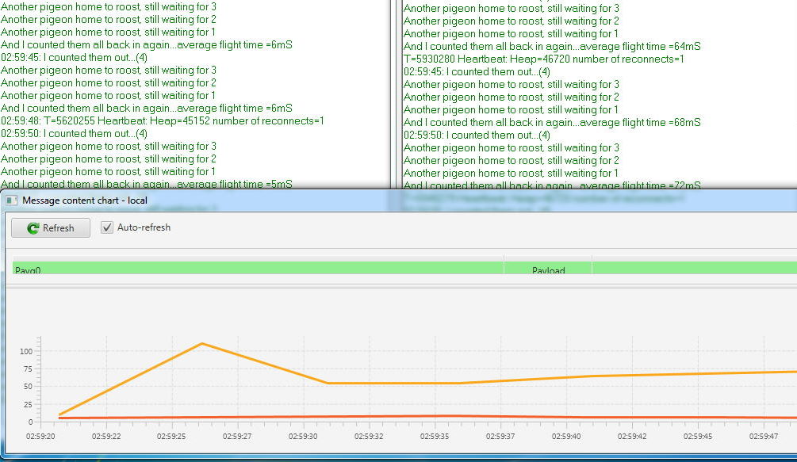
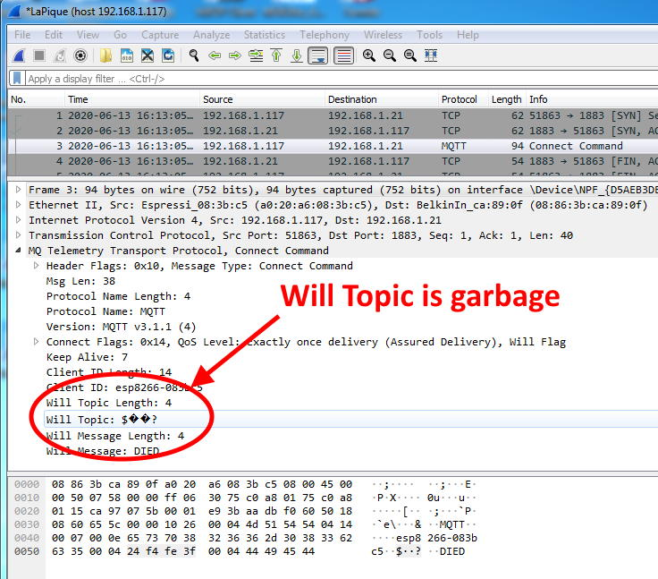
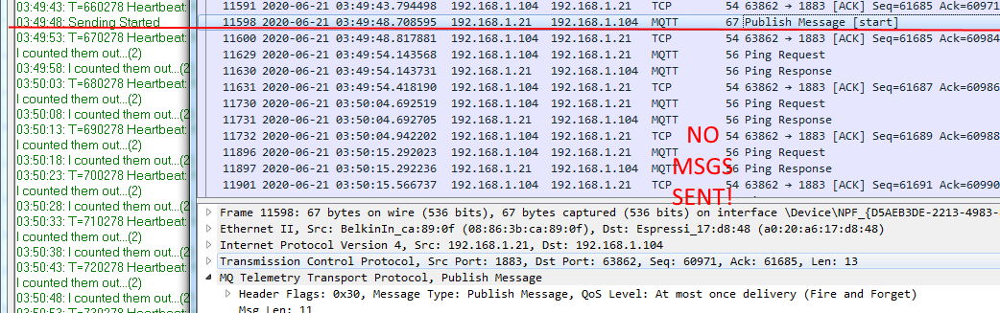
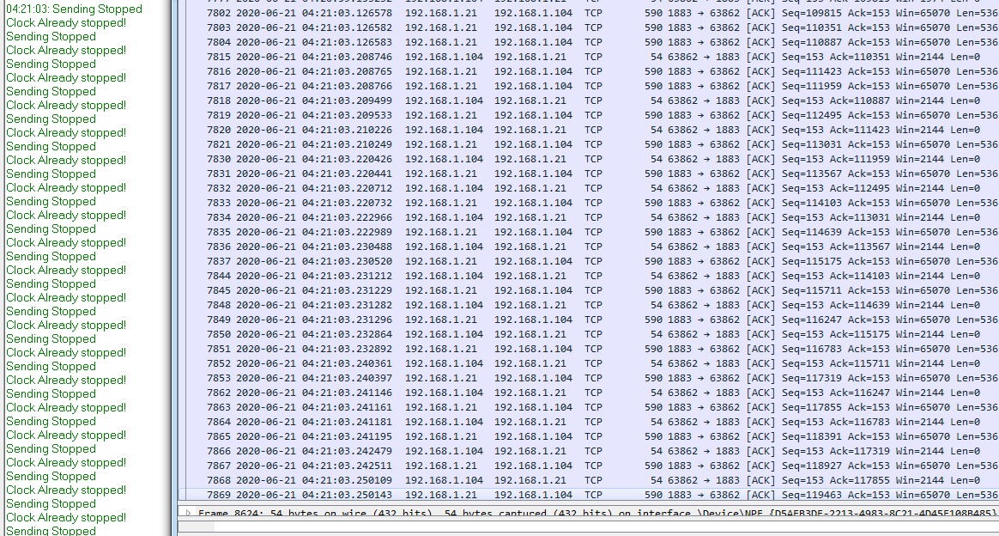
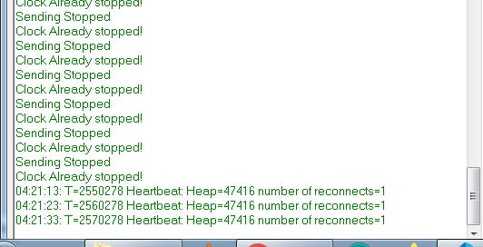
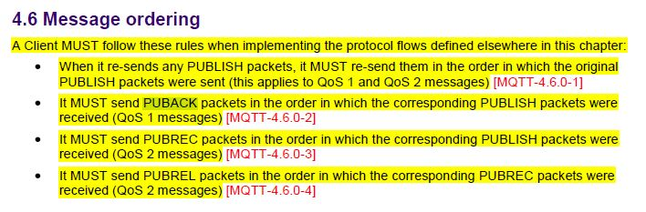
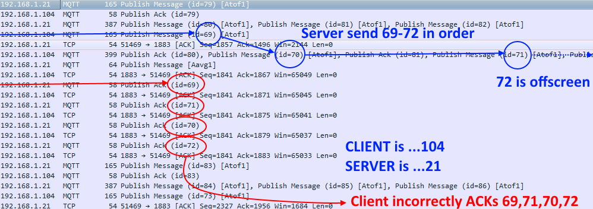
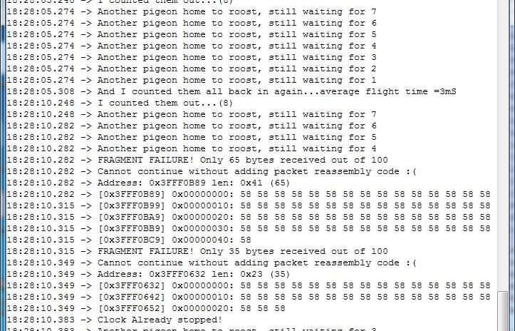
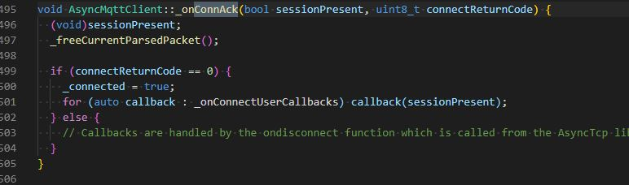
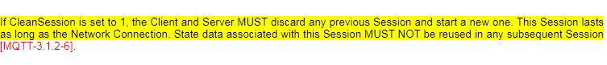

# Bugs and problems in AsyncMqttClient

## Contents
* [Background](#background)
* [Show Me The Bugs](#show-me-the-bugs)
    * [Three major flaws causing the numerous bugs in in AsyncMqttClient](#three-major-flaws-cause-multiple-different-bugs)
    * [List of selected fatal bugs in AsyncMqttClient](#the-main-menu)
* [Evidence](#evidence)
  
## Background

The original intention was to provide a range of examples to allow the user to compare the two libraries in terms of capability, stability and peformance. So for example there was originally a sketch clled TimeOfFlight which sent and received repeated messages, timing how long it took each to make the round-trip between client and server so that the user could compare peformance.

Each sketch was to have an "A_" and a "P_" version so that they could be run side by side to make any such comparisons simple and obvious.
One such test would, for example show Pangolin performing between 10 and 15 times faster than AsyncMqttClient, using identical user code:

That strategy soon had to change, since AsyncMqttClient contained *so many* fatal bugs that the amount of code to "work around" each - just to get *any* value that could be compared - rapidly became unwieldy and rendered any comparisons pointles, since AsyncMqttClient ***simply does not work***

# Show Me The Bugs

When you have seen even this abridged list of problems, you may wonder how AsyncMqttClient ever works *at all* or is used by anybody for anything more than sending one 5-byte temperature reading per day at QoS0.

After a great deal of analysis, it can be shown that almost *all* the various bugs come down to three fundamental flaws in the code. None is a "simple fix" and all would require *significant*, even "ground-up" rewrites.

The flaws *usually* only show themselves when you step outside of an idealised environment and send many messages at once, or a single large message, or the network breaks in the middle of a QoS2 transaction etc in other words: when you use it for a serious app "in the real world".

On the "Happy Path" of:

* Very small payloads
* Infrequent messages
* QoS0-only
* Stable network

AsyncMqttClient does not *usually* enter the "danger zone" where the bugs live and so it *appears* to be fine. Except of course when it randomly and spontaneously enters a disconnect / reconnect (DCX/CNX) loop several times daily, even on the "Happy Path", which is a direct result of "major flaw 1".

## Three major flaws cause multiple different bugs

### Major Flaw #1 "MF1" (The "dangling pointer")

Is a failure by the author of AsyncMqttClient to understand that LwIP is *asynchronous* and will send data when *it* decides to - which is *not* necessarily the same time as when it is called by the library. This means that any data passed to it must stay in existence until LwIP tells the library it is safe to release it.

AsyncMqttClient *always* releases it immediately after the call to send, meaning that it *always* passes an invalid data pointer to LwIP unless the data is static. Yes, *every time*. The only reason it works *at all* is that - by chance - the orignal data is often still in the same place and has not *yet* been overwritten/resued when LwIP decides to send it. When it has *changed* then AsyncMqttClient will fail, it's that simple. Of course this depends on so many different factors that it appears "random". This is the cause of the frequent spontaneous DCX/CNX bug.

### Major Flaw #2 "MF2" (Poor TCP buffer management)

If your call to AsyncMqttClient survives the always-illegal pointer problem, it then meets MF2. On output, the data going into the TCP buffers is not adequately managed, protected or correctly acknowledged, leading to buffer "overruns" and "underruns" which are entirely dependent upon how much data is sent and how quickly you send it, so again, MF2 problems can appear "random".

### Major Flaw #3 "MF3" (Abdication of inbound fragment reassembly)

On input the author expects the user to reassemble any fragmented packets, which is a non-trivial task and beyond many beginners. *If* the user does not write this complex code then two fragments of one message will appear a two individual messages and the user's code will get "out of step" which is annoying, but....

...If the fragmented packet is a "control" packet such as a QoS1 acknowledgement, then since it is never seen as a whole packet by the library, it cannot correctly operate the QoS "handshake" process - which is fatal. Put simply: ***QoS1 and 2 CANNOT work unless input packets are correctly re-assembled and dispatched***

## Selected bugs:

This list is not exhaustive, there are many more, these are just some of the worst and the ones that are either fatal or prevent QoS1 and/or 2 from having any chance of working. Some of the bugs have links to supporting evidence, some don't. For those that don't, you can either take my word or try them yourself: being honest, I just gave up. Bugs caused by honest-to-goodness poor programming are marked "PP"

1. Spontaneous DCX/CNX. [MF1]
2. [Will Topic bug](#setwill) Prevents sketch from starting with non-static input. [MF1]
3. [Bad Subscribe](#bad-subscribe) Invalid topic causes DCX/CNX [PP]
4. No topic validation for subscribe (see above) [PP]
5. [Discarded messages #1](#discarded-messages-1) [MF2]
6. [Discarded messages #2](#discarded-messages-2) [MF2]
7. [Total Message Loss](#total-message-loss) [MF2]
8. No error handling callback [PP]
9. ["Killer Packet" inbound](#killer-packet-inbound) [MF3][PP]
10. [QoS1 Protocol Violation](#qos1-protocol-violation) [MF2][MF3]
11. [Fragment Failure](#fragment-failure) [MF3]
12. [Numerous API errors](api.md) - sufficient for their own document
13. [QoS 1/2 protocol violation - no message resend][PP](#qos-12-protocol-violation---no-message-resend)[PP]
14. [QoS 1/2 protocol violation - no session recovery](#qos-12-protocol-violation---no-session-recovery)[PP]

## Other potential bugs

Not listed above are the multiple instances of random crashes, data corruption etc etc etc also encountered during these tests when Wireshark wasn't running or the example sketch diagnostics happened to be off...

Each of MF1, 2 and 3 can individually be the cause of:

* Random Exceptions
* Random Watchdog Timer resets
* Message data corruption
* Other QoS protocol violations
 
When combining any permutation of them due to a happenstance of timing, the world is your Oyster for potential as-yet-unknown failures.

The inescapable conclusion is that AsyncMqttClient is simply ***not fit for purpose*** and should be avoided at all costs since it simply ***does not work***

---
# Evidence

## setWill

Any temporary (e.g. stack variable) passed in causes corrupt data which causes MQTT to close the connection, which causes DCX/CNX loop. See failing code and workaround in `options.h`

## Bad subscribe

Not all topics are valid, e.g. `"bogus#"`. MQTT will return an error code when one is passed in. AsyncMqttClient ignores it and continues whether its valid or not. It has no mechanism to report this error.

## Discarded Messages #1

Imagine a metric called "buffer speed". I have a buffer size X and when it is full I send it. BUT I will also send it even when only part-full if a certain length of time has expired, so I don't hang around for ever waiting for it to be filled (possibly never). So the BS factor depends on that timeout and the actual size. Let's give it imaginary units of Byte-Seconds or...BS and for the sake of argument say its 1000. Which means you can send 1000 bytes every second or two lumps of 500 every 1/2 second etc. If your chunks are 100 bytes you can send ten per second before it becomes a problem. Will the BS allow you 2000 bytes every two seconds? Read On.

Exceeding the BS with 10 consecutive messages of 100 bytes: only 9 get sent. Code continues regardless, no mechanism for warning of the failure.

## Discarded Messages #2

Exceeding the BS with 4 consecutive messages of 500 bytes: only 2 get sent. Code continues regardless, no mechanism for warning of the failure.

## Total message loss

Exceeding the BS with 2 consecutive messages of 1500 bytes: *none* get sent. Zero, zip, nada. Code continues regardless, no mechanism for warning of the failure.

## "Killer Packet" inbound

MQTT client sends huge packet, e.g. 50kb AsyncMqttClient has no reassembly code hence simply forwards all fragments to the user, whether he can handle them or not. If *the user* has no reassembly code (why *should* he?), he wil get dozens of apparently invalid messages (and thus *anything* can happen if he assumes they are valid packets). No way to notify the user, no way to stop the flow until massive packet fragment have all bee sent to the user.

It often results in a crash, but occasionally entertains, for example after a failed Killer packet test, the "stop" command was sent to [the sketch](../examples/ShowMeTheBugs/ShowMeTheBugs.ino). It did nothing for about haf a minute, then - out of the blue - it reported is had received the `stop` command hundreds of times:

And did so continuously for 10 seconds, whereupon it stopped as spontanesouly as it had started

## QoS1 protocol violation

The list of violations of QoS promises are so extensive and fundamentally broken that is hard to pick the best example, so instead, here is one that is very easy to understand, even for the non-technically minded

The MQTT specifiction states:

Note 4.6.0-2 "It MUST send PUBACK packets in the order..."

AsyncMqttClient sending QoS1 packets out of order:

And yes, this *does* matter - very much - or why would the spec insist upon it? The simple answer is that the library cannot keep its QoS1 promise if this is not true, hence yet more proof that AsyncMqttClient simply ***does not work*** above QoS0

## Fragment failure

User is sending 8 messages of 100 bytes each. Why would he think he even *needed* complex reassembly code for such small packets when there is a 1072 byte buffer even with "LwIP Low Memory"? That question assumes he knows what any of the above means...

Either way, without such obscure code, his own will fail. He sends out 8 messages and gets back...9. Or 10.
Or more. Depends on just *how* wrongly AsyncMqttClient mismanages its buffers at the time. 

This flaw alone renders the whole library worthless above QoS0. We know for a fact that it does not handle incoming fragment reassembly: the author even tries to explain that in his own documentation. What he fails to do is realise the implications of his own statements:

In the above example its is only the user who is inconvenienced or confused, but consider *this*

MQTT QoS depends on a "handshake" protocol of packet exchange. At QoS1 I send PUBLISH server replies PUBACK for example. Both PUBLISH and PUBACK are merely lumps of data - *which may get fragmented* and we already know AsyncMqttClient *does not reassemble fragments*. So how can it possibly recognise a control packet split over a fragment boundary? It does not take Sherlock Holmes to deduce that if it can't recognise a control packet, it can't do QoS *at all* let alone "properly".

Except of course in the "lucky" cases where no particularly troublesome combination of message size, buffer size and send/recieve rate conspire to always put whole control packets "on the wire". In the "random" cases where they *do* - it will fail.

## QoS 1/2 Protocol Violation - no message resend

TOL makes no attempt whatsover to conform with MQTT-4.4.0-1 and resend failed QoS1 and/or 2 transactions on reconnect:

## QoS 1/2 Protocol Violation - no session recovery

The code above also does not check the returned session state, therefore it cannot possible react / behave differently when session recovery is required and is a protocol violation of MQTT-3.1.2-6
