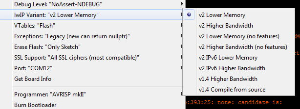

# The challenges of MQTT on embedded systems

## Contents

1. [Quality of service guarantees](#1-quality-of-service-guarantees)
2. [Large payloads](#2-large-payloads)

## 1. Quality of service guarantees

Almost *no* embedded system can *fully* support MQTT "Quality of service" (QoS) levels 1 & 2, for two reasons:

### 1.1 The [MQTT 3.1.1 spec](http://docs.oasis-open.org/mqtt/mqtt/v3.1.1/os/mqtt-v3.1.1-os.html) itself states

*"4.1 Storing state 
It is necessary for the Client and Server to store Session state in order to provide Quality of Service guarantees. The Client and Server MUST store Session state for the entire duration of the Session [MQTT-4.1.0-1]. A Session MUST last at least as long it has an active Network Connection [MQTT-4.1.0- 2].*

*Non normative comment*

*The storage capabilities of Client and Server implementations will of course have limits in terms  of capacity and may be subject to administrative policies such as the maximum time that Session  state is stored between Network Connections. Stored Session state can be discarded as a result  of an administrator action, including an automated response to defined conditions. This has the  effect of terminating the Session. These actions might be prompted by resource constraints or for  other operational reasons. It is prudent to evaluate the storage capabilities of the Client and  Server to ensure that they are sufficient.*

*Non normative comment*

*It is possible that hardware or software failures may result in loss or corruption of Session state  stored by the Client or Server.*

*Non normative comment*

*Normal operation of the Client of Server could mean that stored state is lost or corrupted because  of administrator action, hardware failure or software failure. An administrator action could be an  automated response to defined conditions. These actions might be prompted by resource  constraints or for other operational reasons. For example the server might determine that based  on external knowledge, a message or messages can no longer be delivered to any current or  future client.*

*Non normative comment*

*An MQTT user should evaluate the storage capabilities of the MQTT Client and Server  implementations to ensure that they are sufficient for their needs."*

### 1.2 Absent/limited storage space on embedded systems

It is obvious from point 1 that no embedded system without permanent storage, e.g. SPIFFS / LittleFS, other FLASH filing systems or external SD / MMIO support etc can *fully* support QoS2 except throughout the lifetime of a single session. If the device reboots, all session state is lost on reboot and thus two problems now exist:

#### 1.2.1 Outbound non-compliance

It cannot re-transmit any of its own failed outbound messages that were not ACKed by the server, since it no longer holds any record of them.

#### 1.2.2 Inbound non-compliance

It cannot recognise and ACK any incoming retransmit requests from the server, since they are all identified by server messageIDs that the client no longer holds. As well as not being able to satisfy the requirements of MQTT 3.1.1, it must also guard against trying to do lookups on internal data structures (that are - of course - all currently empty!) using the incoming *server* message ID while also expecting it to exist (as it *would* always do in mid-session). As a very minimum it needs to silently ignore them (see later).

#### 1.2.3 Methods of Graceful failure

MQTT says: *"4.4 Message delivery retry*

*When a Client reconnects with CleanSession set to 0, both the Client and Server MUST re-send any  unacknowledged PUBLISH Packets (where QoS > 0) and PUBREL Packets using their original Packet Identifiers [MQTT-4.4.0-1]. This is the only circumstance where a Client or Server is REQUIRED to redeliver messages."*

Being physically unable to comply due to both 1.2.1 and 1.2.2 above, the embedded client has few healthy choices: 

##### 1.2.3.1 Just lie!

It can "lie" to the server and ACK the incoming IDs regardless of whether they were delivered or not: "Confirm delivery of ID 666? Of *of course* I delivered it!...`server.sendACK(666);`"

The success of this method depends on which of the two recommeded algorithms A or B is used (see "Figure 4.3 – QoS 2 protocol flow diagram, non normative example" in the [MQTT 3.1.1 spec](http://docs.oasis-open.org/mqtt/mqtt/v3.1.1/os/mqtt-v3.1.1-os.html) ), Using method B allows the lie to go unnoticed *and* actually satisifes QoS2 rules *if* you actually managed to deliver the message before the loss of connection. `PangolinMQTT` takes this approach.

Method A, well... didn't you mother tell you "lying never pays"? The server will *think* it has successfully delivered the QoS2 "exactly once" but as when ordering cheap things from various far-flung nations, the client is left forever shouting "Oi! Where's my packet???" - and he will *never* receive it, thus breaking the QoS2 promise.

##### 1.2.3.2 Put its fingers in its ears and go "ner! ner! ner!"

The client can simply ignore the incoming retransmit requests while ever the server continues to send them. This will be...a long long time and depend on the specific implementation and/or storage capacity and the interpretation of "reasonble time" that the author chose. But they will keep on coming even after the next reboot, unless...

##### 1.2.3.3 Sweep it under the carpet

The client can simply close the connection containing the session data and reopen it with a clean session. Crisis? What Crisis?

##### 1.2.3.4 Bury its head in the sand / Groundhog Day

These pesky "issues" only occur when using MQTT sessions. You can simply avoid all of the pain by always starting with a clean session. Every day is exactly the same as the last, and no haunting memories of yesterday's failures will ever trouble you. You just need to be able to live with the (admittedly *very* rare) cases where a "promised" package never actually arrives. If you use ebay or aliexpress or amazon then you already know how to survive that.

## 2. Large Payloads

Most modern MCUs are *so* capable that folk tend to forget they are not programming a high-end server. In the real world, it's like being back in the 1970s when even the most powerful mainframes had memory measured in "k" not "M" and the only "Gig" anyone knew was when the local band played at the Town Hall.

Memory management (read "minimisation") is therefore hyper-critical on all embedded MCUs. On *connected* MCUs it's worse , as data packets fly in at random: sometimes with hours in between, sometimes in sudden massive bursts and they *all* have to be dealt with. A common standard network library used across multiple processor families is the "LwIP" (**L**ight**w**eight**IP**) library.

As it designed from the outset to be hardware-independent, it is highly configurable - to the point of bewilderment, requiring extensive TCP/IP knowledge. Luckily for us mere mortals, those complex decisions have already been made by the base library providers for our preferred family of machines, but the point here is: *they are likely to be different for every architecture*. Thus coding an app assuming 4x1460 byte buffers on a system that has been configured with only 2x 536b buffers is likely to end in tears.

A second important point is that hard-coding *any* assumptions that rely on factors beyond your control which can change at any time is never a good idea. If the gods who configured LwIP for your platform decide - for whatever reason - to "upgrade" their choices, then get ready for some debugging.

Worse, if the platform offers user choices which change those settings, as for examples does the Arduino IDE

*(The "Lower Memory" options set TCP_MSS to 536 while "Higher Bandwidth" sets it to 1460)*

Coding a supposedly portable *library* whic makes such unsafe assumptions or relies on specific implementation parameters is unacceptable.

The take-away form this is that you app *needs* to know this value and stay below it by limiting the maximum payload size if it is to avoid...

### 2.1 TCP packet reassembly

Well-designed libraries will present the user API with a chunk or stream of data that requires no knowledge of the underlying physical network MTU, LwIP TCP_MSS size, nor a dozen other parameters: It just "gives you the data". In order to do this it needs to _reassemble smaller blocks into larger packets before passing them on.

Imagine the implementation has a single 1k buffer and you get sent a 3.3k message (*and* - of course - that your app has allocated - say - a max sized buffer of 4k). The library you call will get 3x 1k blocks from the network layer which it has to hold on to until all the data are received and one 0.3k block which it then glues together and sends to you. You are none the wiser: you "just get" the 3.3kb message without needing to understand what goes on "under the hood".

If on the other hand, the user - *beyond your control* - changes some options which reduce the buffers to 2k, you are going to have problems with that 3.3k message!

### 2.2 Limits

No amount of reassembly is going to solve *huge* payloads: at some point, your MCU is going to run out of resources. Yes, streaming or "chunking" can help, but it complicates the code and even then at *some point* someone (usually you) has to make a decision about the maximum buffer size. There are three ways to think about the decision:

#### a) Limit it to a very small value...

...that will *always* be guaranteed to be present, no matter how minimal the implementation, i.e. less than 1x the smallest allowable LwIP buffer. This is the approach taken by `PubSubClient` which - by default - limits the payload to 128 bytes. For small apps (e.g. most IOT sensors) short messages like this are fine. A 2-decimal place temperature value only needs 5 characters when sent in plain text *and* it's not the end of the world if the odd one or two fail to arrive, hence QoS0 here is perfectly acceptable.

`PubSubClient` only allows QoS0 so it is perfect for the large majority of typical small IOT applications. It's almost as if it was designed to be the "best in class" for these undemanding apps: it has everything it needs and not a single ounce of fat. It should come as no suprise then, to know that its author Nick O'Leary is in the list of contributors to the MQTT standard, and just happened to also write a little thing called "NODE-RED".

If you want a 100% compliant, small, fast, stable, well supported QoS0 client, then `PubSubClient` is the only place to go as long as you don't need big payloads. I cannot recommend it highly enough (which also goes for any other work by the same author)

#### b) Limit it to the size of a single LwIP buffer...

...which is slightly better than a) but still poor *and* subject to changeable factors beyond the library's control.

While it seems at first sight to be a valid option, it is actually the *worst of both worlds* for a number of reasons which are beyond the scope of this simple document.

#### c) "The Gold Standard"

Allow the user to decide the maximum safe size for his implementation (while providing a "sensible" safe default), reassemble the underlying packets and deliver a single correctly-sized payload to the the user API both inbound and outbound.

Inherent in this approach is that *any* library adopting it must also gracefully reject any message larger than than the user-defined maximum and then notify him clearly of the fact, without crashing.

This is the method currently used by `PangolinMQTT`. Additionally, it provides an `onError` callback to notify the user of "Killer Packets" that would otherwise break the memory limits, and safely discards any oversized incoming data.

---

## Find me daily in these FB groups

* [Pangolin Support](https://www.facebook.com/groups/pangolinmqtt/)
* [ESP8266 & ESP32 Microcontrollers](https://www.facebook.com/groups/2125820374390340/)
* [ESP Developers](https://www.facebook.com/groups/ESP8266/)
* [H4/Plugins support](https://www.facebook.com/groups/h4plugins)

I am always grateful for any $upport on [Patreon](https://www.patreon.com/esparto) :)

(C) 2020 Phil Bowles
